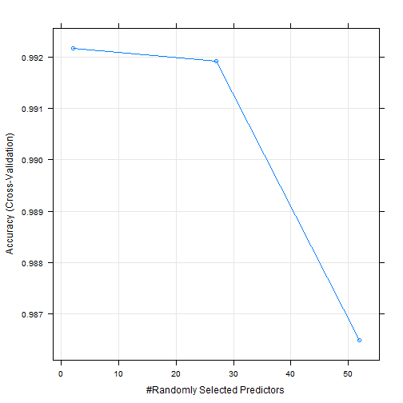
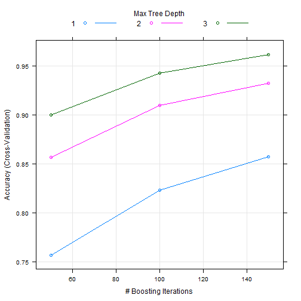

# Course Project: Human Activity Recognition

## Overview

Using devices such as Jawbone Up, Nike FuelBand, and Fitbit it is now possible to collect a large amount of data about personal activity relatively inexpensively. These type of devices are part of the quantified self movement – a group of enthusiasts who take measurements about themselves regularly to improve their health, to find patterns in their behavior, or because they are tech geeks. One thing that people regularly do is quantify how much of a particular activity they do, but they rarely quantify how well they do it. 

In this project, we will use data from accelerometers on the belt, forearm, arm, and dumbell of 6 participants to predict the manner in which they did the exercise. This is the "classe" variable in the training set.

## Global Option

The report includes the code that were used to build the model. 


```r
knitr::opts_chunk$set(echo = TRUE)
```

## Data Loading

The data used for the model comes from the website **Weight Lifting Exercise**. More information is available here [WLE](http://web.archive.org/web/20161224072740/http:/groupware.les.inf.puc-rio.br/har). There are two files, the training dataset and the test dataset.


```r
if(!file.exists("./Data")){
    dir.create("./Data")
    
    trainingFile <- "https://d396qusza40orc.cloudfront.net/predmachlearn/pml-training.csv"
    testFile <- "https://d396qusza40orc.cloudfront.net/predmachlearn/pml-testing.csv"
    
    download.file(trainingFile, destfile = "./Data/pml-training.csv")
    download.file(testFile, destfile = "./Data/pml-testing.csv")
}
```

## Required Libraries

The packages used for the model are **caret** and **tidyverse**(helps with any transformation of the data).


```r
library(caret)
library(tidyverse)
```

## Reading, Cleaning and Exploring Data

After reading the **training** dataset and **test** dataset, we proceed to do some basic exploring. 


```r
trainingData <- read.csv("./Data/pml-training.csv")
testData <- read.csv("./Data/pml-testing.csv")
```


```r
dim(trainingData)
```

```
[1] 19622   160
```

```r
dim(testData)
```

```
[1]  20 160
```
Both dataset have 160 variables. The training dataset has 19622 observation and the test dataset has 20 observation. Next we are going to apply some cleaning process to the training dataset and doing the same process to the test dataset. 

### Removing Subject Identification Variables

Lets remove the first 7 variables that identify subjects and have no impact on the outcome **classe**.


```r
idColumns <- c("X", "user_name", "raw_timestamp_part_1", "raw_timestamp_part_2", "cvtd_timestamp", 
                "new_window", "num_window")
trainingSet <- select(trainingData, !all_of(idColumns))
testSet <- select(testData, !all_of(idColumns))
```
Now removing the variables that contains at least **95%** of missing values.

```r
NAcolumns <- apply(is.na(trainingSet), 2, mean) > 0.95
trainingSet <- trainingSet %>% select(!names(NAcolumns[NAcolumns == TRUE]))
testSet <- testSet %>% select(!names(NAcolumns[NAcolumns == TRUE]))
```

Then we proceed to remove the variables that are near zero-variance

```r
nzv <- nearZeroVar(trainingSet, saveMetrics = TRUE)
trainingSet <- trainingSet[, nzv$nzv == FALSE]
testSet <- testSet[, nzv$nzv == FALSE]
```
Validating dimensions of our final datasets.

```r
dim(trainingSet)
```

```
[1] 19622    53
```

```r
dim(testSet)
```

```
[1] 20 53
```

## Model Building
We are comparing two algorithms and making a choice between them to predict the **classe** of our test dataset.
First we are setting our seed for reproducibility and then split the training dataset into a smaller training dataset and validation dataset. We are going to use the resulting datasets to train and test the performance of the models without seeing the original **Test Set**. 


```r
set.seed(100591)
inTrain <- createDataPartition(y = trainingSet$classe, p = 0.8, list = FALSE)
train_train <- trainingSet[inTrain, ]
test_train <- trainingSet[-inTrain, ]
```

To fit the model, we are setting the **trainControl** function to use 5-fold cross validation for the model.

```r
fitControl <- trainControl(method = "cv", number = 5, verboseIter = FALSE)
```

### Random Forest Model

The first model is Random Forest. We are using the **train** function to create the model with the trControl argument that is equal to our tunning fitControl parameter.


```r
modRFFit <- train(classe ~ ., method = "rf", data = train_train, trControl = fitControl)
modRFFit$finalModel
```

```

Call:
 randomForest(x = x, y = y, mtry = param$mtry) 
               Type of random forest: classification
                     Number of trees: 500
No. of variables tried at each split: 2

        OOB estimate of  error rate: 0.64%
Confusion matrix:
     A    B    C    D    E class.error
A 4461    2    1    0    0 0.000672043
B   19 3011    8    0    0 0.008887426
C    0   19 2716    3    0 0.008035062
D    0    0   42 2529    2 0.017100661
E    0    0    0    5 2881 0.001732502
```

Then we proceed to predict the classe in the validation dataset and apply the confusion Matrix to measure the accuracy of the model.


```r
results <- predict(modRFFit, newdata = test_train)
confusionMatrix(test_train$classe, results)
```

```
Confusion Matrix and Statistics

          Reference
Prediction    A    B    C    D    E
         A 1116    0    0    0    0
         B    0  759    0    0    0
         C    0   10  674    0    0
         D    0    0   12  631    0
         E    0    0    0    2  719

Overall Statistics
                                          
               Accuracy : 0.9939          
                 95% CI : (0.9909, 0.9961)
    No Information Rate : 0.2845          
    P-Value [Acc > NIR] : < 2.2e-16       
                                          
                  Kappa : 0.9923          
                                          
 Mcnemar's Test P-Value : NA              

Statistics by Class:

                     Class: A Class: B Class: C Class: D Class: E
Sensitivity            1.0000   0.9870   0.9825   0.9968   1.0000
Specificity            1.0000   1.0000   0.9969   0.9964   0.9994
Pos Pred Value         1.0000   1.0000   0.9854   0.9813   0.9972
Neg Pred Value         1.0000   0.9968   0.9963   0.9994   1.0000
Prevalence             0.2845   0.1960   0.1749   0.1614   0.1833
Detection Rate         0.2845   0.1935   0.1718   0.1608   0.1833
Detection Prevalence   0.2845   0.1935   0.1744   0.1639   0.1838
Balanced Accuracy      1.0000   0.9935   0.9897   0.9966   0.9997
```

The accuracy rate of the first model is **0.9939** and therefore the out of sample error is equal to **0.0061**. It's a great performance. Now plotting the model.



### Generalized Boosted Model

The second is a Generalized Boosted Model. We are using the **train** function to create the model with the trControl argument that is equal to our tunning fitControl parameter.


```r
modBGMFit <- train(classe ~ ., method = "gbm", data = train_train, verbose = FALSE, 
                   trControl = fitControl)
modBGMFit$finalModel
```

```
A gradient boosted model with multinomial loss function.
150 iterations were performed.
There were 52 predictors of which 51 had non-zero influence.
```

Then we proceed to predict the classe in the validation dataset and apply the confusion Matrix to measure the accuracy of the model.


```r
results <- predict(modBGMFit, newdata = test_train)
confusionMatrix(test_train$classe, results)
```

```
Confusion Matrix and Statistics

          Reference
Prediction    A    B    C    D    E
         A 1095   13    6    2    0
         B   25  713   20    1    0
         C    0   28  650    6    0
         D    2    3   27  608    3
         E    3    9    8    9  692

Overall Statistics
                                         
               Accuracy : 0.9579         
                 95% CI : (0.9512, 0.964)
    No Information Rate : 0.2868         
    P-Value [Acc > NIR] : < 2.2e-16      
                                         
                  Kappa : 0.9468         
                                         
 Mcnemar's Test P-Value : 5.058e-07      

Statistics by Class:

                     Class: A Class: B Class: C Class: D Class: E
Sensitivity            0.9733   0.9308   0.9142   0.9712   0.9957
Specificity            0.9925   0.9854   0.9894   0.9894   0.9910
Pos Pred Value         0.9812   0.9394   0.9503   0.9456   0.9598
Neg Pred Value         0.9893   0.9832   0.9812   0.9945   0.9991
Prevalence             0.2868   0.1953   0.1812   0.1596   0.1772
Detection Rate         0.2791   0.1817   0.1657   0.1550   0.1764
Detection Prevalence   0.2845   0.1935   0.1744   0.1639   0.1838
Balanced Accuracy      0.9829   0.9581   0.9518   0.9803   0.9933
```

The accuracy rate of the first model is **0.9579** and therefore the out of sample error is equal to **0.0421**. The performance of the GB Model is lower than the random forest model. Now plotting the model.




### Final Results

The Random Forest model is the best to predict the **classe** of the orignal **Test Set** according to the accuracy rate values of the two models. Thus, the final step is to create the model with all the original **Training Set** and predict the **classe** of the test set. The results output will be used to answer the **Prediction Quiz**.


```r
finalModRF <- train(classe ~ ., method = "rf", data = trainingSet, 
                    trControl = fitControl)
finalModRF$finalModel
```

```

Call:
 randomForest(x = x, y = y, mtry = param$mtry) 
               Type of random forest: classification
                     Number of trees: 500
No. of variables tried at each split: 2

        OOB estimate of  error rate: 0.41%
Confusion matrix:
     A    B    C    D    E  class.error
A 5578    2    0    0    0 0.0003584229
B   11 3782    4    0    0 0.0039504872
C    0   18 3402    2    0 0.0058445354
D    0    0   39 3175    2 0.0127487562
E    0    0    0    3 3604 0.0008317161
```

```r
quizPrediction <- predict(finalModRF, newdata = testSet)
```

